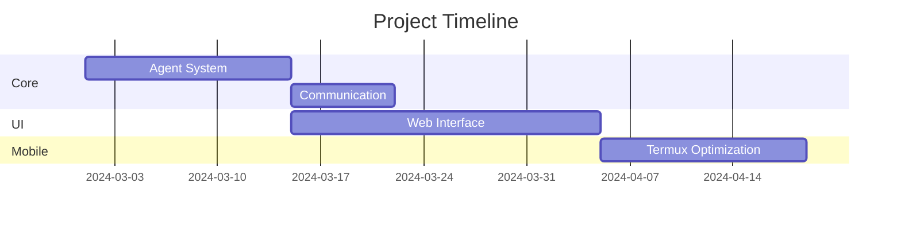

# TrippleEffect Project Plan

## Vision
Create a mobile-first LLM collaboration framework where 3 specialized agents can:
1. Process complex user requests through distributed cognition
2. Develop and test tools in isolated environments
3. Maintain persistent configurations with enterprise-grade controls

## Core Components
### 1. Agent System
- Configuration Management
- Model API Abstraction Layer
- Stateful Execution Contexts

### 2. Communication Framework
- Message Routing System
- Collaboration Protocol
- Real-time Update Channel

### 3. Sandbox Environment
- Virtualized Python Workspaces
- Security Containment Layer
- Tool Development Kit

### 4. Web Interface
- Multi-modal Input System
- Agent Activity Monitor
- Collapsible Workspaces

### 5. Security System
- Resource Quotas
- Network Firewalling
- Code Validation

## Development Phases

### Phase 1: Core System (2 Weeks)
- [ ] Agent Configuration Loader
- [ ] API Client Framework
- [ ] Basic Message Routing
- [ ] SQLite Database Schema

### Phase 2: UI & Sandbox (3 Weeks)
- [ ] Flask Web Interface
- [ ] Venv Management System
- [ ] Tool Development Protocol
- [ ] File Attachment Handler

### Phase 3: Integration (1 Week)
- [ ] API Model Discovery
- [ ] Cross-Agent Validation
- [ ] Security Policy Engine
- [ ] Voice Input Support

### Phase 4: Mobile Optimization (1 Week)
- [ ] Termux Compatibility Layer
- [ ] Resource Monitor
- [ ] Offline Caching
- [ ] Battery Optimization

## Technical Specifications
**Stack:**
- Language: Python 3.10
- Web Framework: Flask + WebSockets
- Database: SQLite + Alembic Migrations
- Security: SELinux policies + Resource limits

**Key Algorithms:**
1. Agent Message Prioritization
2. Sandbox Escape Prevention
3. Model Configuration Inheritance
4. Tool Dependency Resolution

## Non-Functional Requirements
1. Mobile Performance:
   - Max 200MB RAM per agent
   - Cold start < 15s
   - Background operation support

2. Security:
   - Full process isolation
   - Automatic secret rotation
   - Read-only base environment

3. Extensibility:
   - Plugin architecture
   - Multi-provider support
   - Configuration templates

## Risk Management
| Risk | Probability | Impact | Mitigation |
|------|-------------|--------|------------|
| API Service Outage | Medium | High | Local model fallback |
| Mobile Resource Exhaustion | High | Critical | Aggressive process limits |
| Sandbox Escape | Low | Catastrophic | Hardware-assisted virtualization |
| Agent Deadlock | Medium | High | Timeout-driven reset |

## Documentation Strategy
1. Live API Documentation (Redoc)
2. Interactive Configuration Wizard
3. Threat Model White paper
4. Mobile Optimization Guide

## Testing Plan
1. Unit Tests: pytest (85% coverage)
2. Integration: Dockerized Termux emulator
3. Security: OWASP ZAP scans
4. Load Testing: Locust (50 concurrent sessions)

## Roadmap

## Contribution Guidelines
1. Fork → Feature Branch → Signed Commit
2. Pre-commit Hooks:
   - Black formatting
   - Bandit security scan
3. PR Requirements:
   - Test coverage report
   - Threat model analysis
   - Mobile impact assessment
