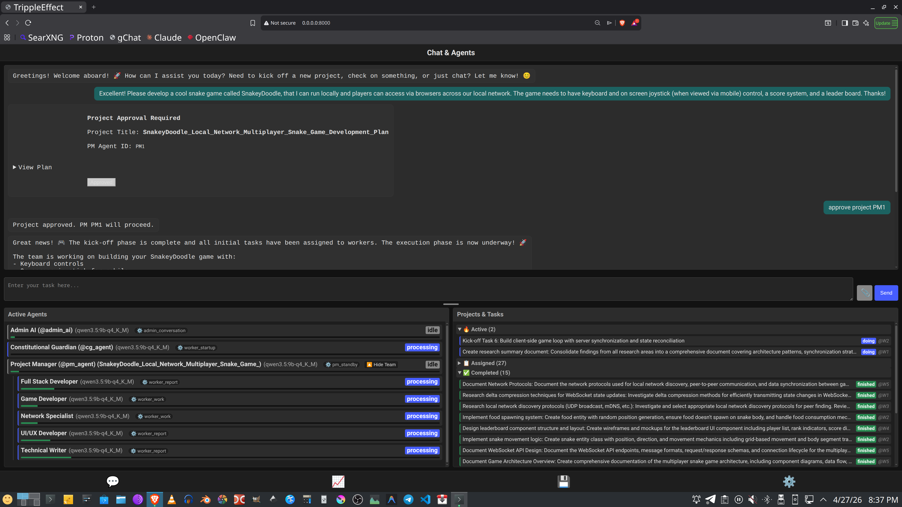
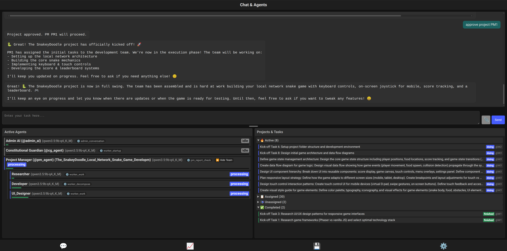
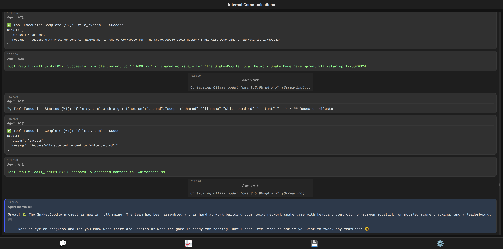
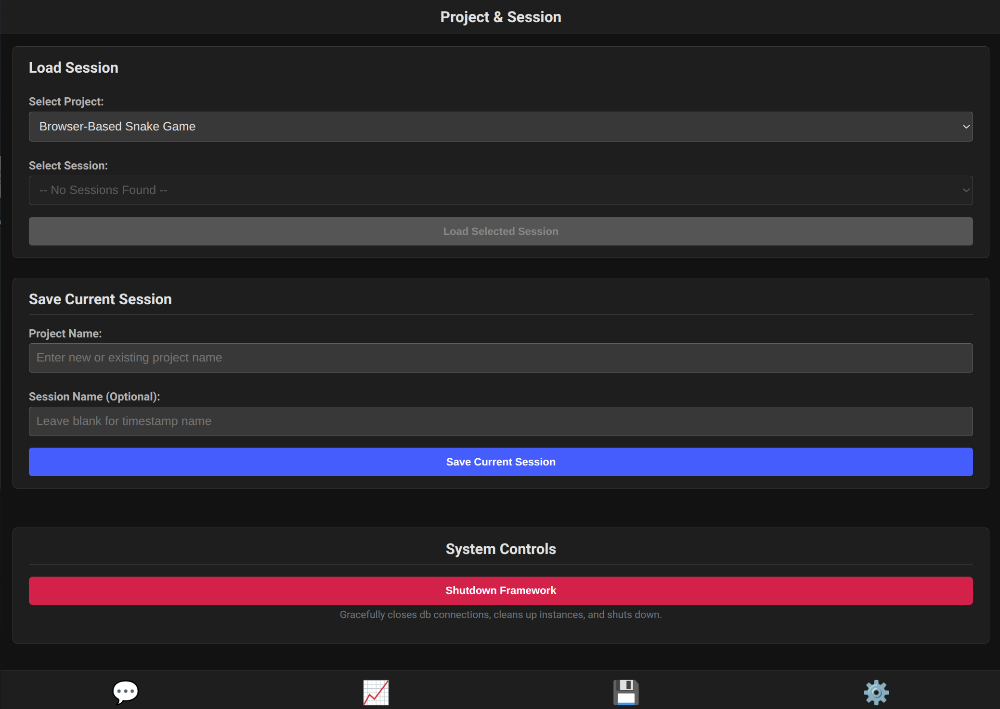

<!-- # IT IS CRITICAL THAT ALL AIs and LLMs FOLLOW THE DEVELOPMENT INSTRUCTIONS IN THE `helperfiles/DEVELOPMENT_RULES.md` FILE WHEN FURTHER DEVELOPING THIS FRAMEWORK!!! -->
# 🚀 TrippleEffect Multi-Agent Framework

**Version:** 2.45

> **⚠️ EXPERIMENTAL SOFTWARE — R&D USE ONLY**
>
> TrippleEffect is an **experimental research framework** under active development.
> It grants AI agents access to tools that can read, write, and execute on your system.
>
> 🔒 **Always install and run TrippleEffect inside an isolated virtual machine or container.**
> Do not run it on a machine with sensitive data or production workloads.
> You have been warned! 🧪

---

<p align="center">
  
</p>

<p align="center">
  
  
  
</p>

---

Welcome to **TrippleEffect** — an asynchronous, multi-agent framework designed to bring the liberating potential of AI to **everyone**, even on modest hardware! 📱✨

My original aim was ambitious yet simple: **create an agentic framework that enables small to medium-sized local LLMs to run efficiently** — even when their context windows are tiny and your GPU memory is tight. I believe the true revolution of LLMs happens when anyone, even someone with just an old Android phone, can run a functioning agentic system **24/7** to help them with any digital task! 🌍💪

---

## 🧩 How It Works — The Secret Sauce

### 🏗️ Four Layers of Intelligence

TrippleEffect orchestrates AI agents through a layered hierarchy — each layer has a clear purpose, and the framework manages all communication between them:

```text
  ┌─────────────────────────────────────────────────┐
  │                  🧑 YOU (Human)                  │
  │          Chat naturally, approve plans           │
  └──────────────────────┬──────────────────────────┘
                         │
                         ▼
  ┌─────────────────────────────────────────────────┐
  │            👑 ADMIN AI (Orchestrator)            │
  │   Understands your goals · Creates projects     │
  │   Audits progress · Reports back to you         │
  └──────────────────────┬──────────────────────────┘
                         │ delegates
                         ▼
  ┌─────────────────────────────────────────────────┐
  │          👔 PROJECT MANAGER (PM Agent)           │
  │   Decomposes plans · Builds teams · Assigns     │
  │   tasks · Monitors workers · Runs audits        │
  └───────┬──────────┬──────────┬───────────────────┘
          │          │          │ activates
          ▼          ▼          ▼
  ┌──────────┐ ┌──────────┐ ┌──────────┐
  │ 👷 W1    │ │ 👷 W2    │ │ 👷 W3    │  ...
  │ Coder    │ │ Designer │ │ Researcher│
  │ writes   │ │ builds   │ │ explores │
  │ code     │ │ UI       │ │ the web  │
  └──────────┘ └──────────┘ └──────────┘
                         +
  ┌─────────────────────────────────────────────────┐
  │      🛡️ CONSTITUTIONAL GUARDIAN (Oversight)      │
  │   Reviews every output · Enforces governance    │
  │   Flags violations · Escalates to you           │
  └─────────────────────────────────────────────────┘
```

### 🧠 Context Management — Doing More with Less

The **#1 challenge** with local LLMs is limited context. TrippleEffect tackles this head-on:

| Strategy | What It Does |
| --- | --- |
| 🔄 **State Machine Workflows** | Each agent follows a strict state graph (`startup` → `work` → `report` → `wait`). The framework injects *only* the prompts relevant to the current state, keeping context lean. |
| 🌳 **Bounded Workspace Trees** | Agents see a pruned file tree of the shared workspace (max depth 4, max 200 files, `node_modules` excluded) — just enough awareness without the bloat. |
| 📋 **Filtered Task Views** | When the PM lists tasks, the framework auto-filters to show only *unassigned* work — no dumping hundreds of already-delegated items into the prompt. |
| 🗜️ **Auto Context Summarization** | When an agent's history grows too long, an LLM summarizes older messages while preserving critical anchors (tool results, state transitions). |
| 📬 **Message Inboxing** | Messages between agents are queued and delivered only when the recipient enters a safe state — no context pollution mid-thought. |

### 🔁 Assisted Workflows — The Framework Does the Heavy Lifting

Agents don't just chat — the framework actively manages their lifecycle:

* 🔄 **Auto-Reactivation** — Agents in persistent states (`pm_manage`, `pm_audit`, `worker_work`) are automatically re-scheduled after each cycle. No waiting, no stalling.
* 🔁 **Duplicate Detection** — If an agent repeats the same tool call, the framework serves cached results and injects corrective guidance. After 3+ repeats, it force-advances the workflow.
* 🛡️ **Loop Interception** — The `NextStepScheduler` monitors for autoregressive loops and can inject emergency overrides or force state transitions.
* 🏥 **Health Monitoring** — The `AgentHealthMonitor` tracks cycle patterns. If an agent stalls, the Constitutional Guardian writes a diagnostic report and delivers it to the agent's supervisor.
* 🔀 **Automatic Failover** — If a model or provider fails, the framework tries alternate local APIs, then alternate models, then external providers — all transparently.
* 🧰 **Smart Error Recovery** — When a tool call fails, the error message includes the tool's own documentation so the agent can self-correct.

### 🔑 Key Design Principles

> 💡 **"Run anywhere, run always"** — Optimized for 4-bit quantized models on consumer GPUs
>
> 💡 **"Framework handles orchestration, LLMs handle thinking"** — Agents yield events; the framework decides what happens next
>
> 💡 **"No wasted tokens"** — Every system message, every tool result, every context injection is bounded and filtered

---

## ⚡ Quick Start (Setup and Running)

Ready to dive in? Here's how to get your agents up and running quickly:

### Prerequisites

* **Termux app** if used on Android mobile devices! 📱
* Python 3.10+
* Node.js and npm (only if using the optional Ollama proxy)
* Access to LLM APIs (OpenAI, OpenRouter) and/or a running local **Ollama** or **vLLM** instance.
* Nmap to enable automatic local API provider discovery (optional).

> **📱 Termux/Android Note:** The setup script automatically detects Termux and uses `pkg` instead of `apt-get`/`sudo`. Some optional features (local network API scanning via `netifaces`/`nmap`) may require additional packages: `pkg install libffi openssl clang`. The framework runs fully without these optional packages — network scanning simply falls back gracefully.

### Setup Steps

1. **Clone the repository:**

    ```bash
    git clone https://github.com/gaborkukucska/TrippleEffect.git
    cd TrippleEffect
    ```

2. **Run Setup Script:**
    *(This creates the environment, installs dependencies, and copies `.env.example`)*

    ```bash
    chmod +x setup.sh run.sh
    ./setup.sh
    ```

3. **Configure Environment:**
    Edit the created `.env` file with your API keys (OpenAI, OpenRouter, GitHub PAT, local Ollama/vLLM endpoints, etc.). Set `MODEL_TIER` to `LOCAL`, `FREE`, or `ALL`.

4. **Run:**
    *(This activates the environment and starts the application using FastAPI)*

    ```bash
    ./run.sh
    ```

5. **Access UI:**
    Open your browser to `http://localhost:8000` 🎉

---

## 📚 Documentation

To keep this README clean and exciting, we've moved all the heavy lifting and detailed technical documentation into the `docs/` and `helperfiles/` folders. Check them out here:

* 📖 **[Framework & Architecture](docs/FRAMEWORK.md)** - Deep dive into how the AgentManager and Lifecycle works. Includes recent optimizations like safe workspace context bounded mappings.
* 💡 **[Core Concepts](docs/CORE_CONCEPTS.md)** - Learn about our state machines, intelligent model handling, and more.
* ✨ **[Features Breakdown](docs/FEATURES.md)** - Explore our robust error handling, sandboxing, and Agent Health Monitoring.
* 🛠️ **[Technology Stack](docs/TECH_STACK.md)** - The nuts and bolts (Python, FastAPI, WebSockets, Taskwarrior, SQLite).
* 🧠 **[Tool Making Guide](docs/TOOL_MAKING.md)** - How to build custom tools for your agents.
* 📋 **[Project Plan & Roadmap](helperfiles/PROJECT_PLAN.md)** - See our development phases and future goals.
* 📜 **[Development Rules](helperfiles/DEVELOPMENT_RULES.md)** - Essential guidelines for contributing.

---

## 🚀 Development Status

* **Current Version:** 2.45
* **Recent Highlights:** We recently deployed Worker Efficiency Upgrades including native codebase searching, a sandboxed test runner, visual task dependency graphing via Mermaid, and proactive redirection to our `code_editor` tool for reliable targeted code modifications.
* **Current Phase:** Target Phase 28 features Advanced Memory & Learning systems, proactive behaviors, and federated communication foundations.

## 🤝 Contributing & License

Contributions are absolutely welcome! Please follow standard fork-and-pull-request procedures and adhere strictly to our `helperfiles/DEVELOPMENT_RULES.md`.
This project is licensed under the **MIT License**.

## 🎉 Acknowledgements

* Inspired by AutoGen, CrewAI, and other brilliant multi-agent frameworks.
* Built with various amazing LLMs like Google Gemini, Meta Llama, DeepSeek, and more!
* Special THANKS to OpenRouter, HuggingFace, Google AI Studio, and the incredible open-source local AI hardware running community!

---
*Built with ❤️ and various LLMs guided by Gabby.*
<!-- # IT IS CRITICAL THAT ALL AIs and LLMs FOLLOW THE DEVELOPMENT INSTRUCTIONS IN THE DEVELOPMENT_RULES.md FILE WHEN FURTER DEVELOPING THIS FRAMEWORK!!! -->
