<!-- # START OF FILE helperfiles/PROJECT_PLAN.md -->
# Project Plan: TrippleEffect

**Version:** 1.3 (Completed first part of Phase 6)
**Date:** 2025-04-04 (Note: Should be updated with actual dev dates)

## 1. Project Goals

*   Develop an asynchronous, collaborative multi-agent framework (`TrippleEffect`).
*   Implement a browser-based UI for user interaction, agent configuration, and monitoring.
*   Enable real-time communication between the backend and frontend using WebSockets.
*   Support multiple, configurable LLM agents capable of collaborating on tasks.
*   Allow agents to utilize tools within sandboxed environments.
*   Ensure the framework is reasonably lightweight and performant for potential use on platforms like Termux.
*   Integrate with various LLM API providers (OpenAI, Ollama, OpenRouter supported; extensible).
*   Structure the project logically for maintainability and extensibility.
*   Adhere to the specified development principles (full file analysis, incremental updates with confirmation, consistency, helper file maintenance).

## 2. Scope

**In Scope:**

*   **Core Backend:** FastAPI application, WebSocket management, asynchronous task handling.
*   **Agent Core:** Agent class definition, state management, interaction logic via abstracted LLM providers (including tool use).
*   **Agent Manager:** Coordination logic for multiple agents (task assignment, message routing, tool execution orchestration).
*   **Basic UI:** HTML/CSS/Vanilla JS frontend for submitting tasks, displaying agent outputs, basic configuration, basic tool usage indication, basic file context upload.
*   **Configuration:** Loading agent settings (LLM provider, model, system prompt, temperature, etc.) from `config.yaml`. API keys/URLs via `.env`.
*   **WebSocket Communication:** Real-time streaming of agent thoughts/responses/status to the UI.
*   **Basic Sandboxing:** Creation of dedicated directories for agent file operations (`sandboxes/agent_<id>/`).
*   **Tooling:** Framework (`BaseTool`), executor (`ToolExecutor`), `FileSystemTool`. Mechanism for agents (via LLM tool calling) to request tool use.
*   **LLM Integration:** Support for OpenAI, Ollama, OpenRouter via provider abstraction layer.
*   **Helper Files:** Maintenance of `PROJECT_PLAN.md` and `FUNCTIONS_INDEX.md`.

**Out of Scope (for initial versions, can be added later):**

*   Advanced UI frameworks (React, Vue, etc.).
*   Complex user authentication/multi-user support.
*   Advanced sandboxing (containerization, etc.).
*   Full MCP server implementation.
*   Sophisticated automated testing suite.
*   Complex agent-to-agent delegation protocols.
*   Voice/Camera input processing.
*   Support for *all* possible LLM providers beyond the initial set.
*   Server-side file storage/management beyond agent sandboxes.

## 3. Technology Stack

*   **Backend:** Python 3.9+, FastAPI, Uvicorn
*   **WebSockets:** `websockets` library integrated with FastAPI
*   **LLM Interaction:** `openai` library, `aiohttp`.
*   **Frontend:** HTML5, CSS3, Vanilla JavaScript
*   **Asynchronous Operations:** `asyncio`
*   **Configuration:** YAML (`PyYAML`), `.env` files (`python-dotenv`).
*   **Data Handling:** Pydantic (via FastAPI)

## 4. Proposed Architecture Refinement

(Architecture diagram remains the same as updated in Phase 5.5)

```mermaid
graph LR
    subgraph Frontend
        UI["🌐 Browser UI <br>(HTML/CSS/JS)"]
    end

    subgraph Backend
        FASTAPI["🚀 FastAPI Backend <br>(main.py, api/)"]
        WS_MANAGER["🔌 WebSocket Manager <br>(api/websocket_manager.py)"]
        AGENT_MANAGER["🧑‍💼 Agent Manager <br>(agents/manager.py)"]
        subgraph Agents
            direction LR
            AGENT_INST_1["🤖 Agent Instance 1 <br>(agents/core.py)<br>Uses Provider A"]
            AGENT_INST_2["🤖 Agent Instance 2 <br>Uses Provider B"]
            AGENT_INST_N["🤖 Agent Instance N <br>Uses Provider C"]
        end
        subgraph LLM_Providers ["☁️ LLM Providers <br>(src/llm_providers/)"]
            PROVIDER_A["🔌 Provider A <br>(e.g., OpenAI)"]
            PROVIDER_B["🔌 Provider B <br>(e.g., Ollama)"]
            PROVIDER_C["🔌 Provider C <br>(e.g., OpenRouter)"]
        end
        subgraph Tools
            direction TB
            TOOL_EXECUTOR["🛠️ Tool Executor <br>(tools/executor.py)"]
            TOOL_FS["📄 FileSystem Tool <br>(tools/file_system.py)"]
            TOOL_WEB["🔍 Web Search Tool (Planned)"]
        end
        SANDBOXES["📁 Sandboxes <br>(sandboxes/agent_id/)"]
    end

    subgraph External
        LLM_API_SVC["☁️ External LLM APIs <br>(OpenAI, OpenRouter)"]
        OLLAMA_SVC["⚙️ Local Ollama Service"]
        CONFIG_YAML["⚙️ config.yaml"]
        DOT_ENV[".env File <br>(API Keys, URLs)"]
    end

    %% --- Connections ---
    UI -- HTTP --> FASTAPI;
    UI -- "WebSocket /ws" <--> WS_MANAGER;
    FASTAPI -- Manages --> AGENT_MANAGER;
    WS_MANAGER -- "Forwards/Receives" --> AGENT_MANAGER;
    AGENT_MANAGER -- "Controls/Coordinates" --> AGENT_INST_1;
    AGENT_MANAGER -- "Controls/Coordinates" --> AGENT_INST_2;
    AGENT_MANAGER -- "Controls/Coordinates" --> AGENT_INST_N;
    AGENT_MANAGER -- "Reads Config" --> CONFIG_YAML;
    AGENT_MANAGER -- "Reads Defaults/Secrets" --> DOT_ENV;
    AGENT_MANAGER -- "Instantiates & Injects" --> LLM_Providers;
    AGENT_INST_1 -- Uses --> PROVIDER_A;
    AGENT_INST_2 -- Uses --> PROVIDER_B;
    AGENT_INST_N -- Uses --> PROVIDER_C;
    PROVIDER_A -- Interacts --> LLM_API_SVC;
    PROVIDER_B -- Interacts --> OLLAMA_SVC;
    PROVIDER_C -- Interacts --> LLM_API_SVC;
    AGENT_MANAGER -- "Routes Tool Request" --> TOOL_EXECUTOR;
    TOOL_EXECUTOR -- Executes --> TOOL_FS;
    TOOL_EXECUTOR -- Executes --> TOOL_WEB;
    %% Tool requests flow through provider
    AGENT_INST_1 -- "Requests Tools Via Provider" --> LLM_Providers;
    AGENT_INST_1 -- "File I/O Via Tool" --> SANDBOXES;
    TOOL_FS -- "Operates Within" --> SANDBOXES;

```

*   **`src/llm_providers/`:** Contains base interface and provider implementations.
*   **`src/agents/core.py`**: Interacts with injected `BaseLLMProvider`.
*   **`src/agents/manager.py`**: Instantiates appropriate `LLMProvider` based on config.

## 5. Development Phases & Milestones

**Phase 1: Core Backend Setup & Basic UI (Completed)**
*   [X] Items completed.

**Phase 2: Agent Core & Single Agent Interaction (Completed)**
*   [X] Items completed.

**Phase 3: Multi-Agent Setup & Basic Coordination (Completed)**
*   [X] Items completed (except deferred inter-agent comms).

**Phase 4: Configuration & Sandboxing (Completed)**
*   [X] Items completed (except deferred UI config view).

**Phase 5: Basic Tool Implementation (Internal MCP-Inspired) (Completed)**
*   [X] Items completed.

**Phase 5.5: LLM Provider Abstraction (Completed)**
*   [X] Items completed.

**Phase 6: UI Enhancements & Advanced Features (In Progress)**
*   [X] Improve UI layout for clarity (separate areas for input, system messages, agent outputs).
*   [X] Display detailed agent status indicators (e.g., idle, processing, using tool `[tool_name]`).
*   [X] Implement message history display (currently only live stream - client-side history implemented for session).
*   [X] Add basic file upload capability in UI to send context/files to agents (client-side reading/prepending implemented).
*   [ ] Implement UI for *viewing* agent configurations (from `config.yaml`).
*   [ ] Test and refine multi-provider support, especially tool usage with Ollama/OpenRouter models.

**Phase 7: Refinement, Optimization & Documentation**
*   [ ] Improve error handling and reporting (backend and UI).
*   [ ] Optimize performance, especially WebSocket handling and LLM calls.
*   [ ] Refine sandboxing security (more robust path traversal checks, consider limits).
*   [ ] Add more tools (e.g., simple web search using `aiohttp`).
*   [ ] Write comprehensive usage instructions in `README.md`.
*   [ ] Add more details/refine `FUNCTIONS_INDEX.md`.
*   [ ] Code cleanup and final review.
*   [ ] Create a Project Plan for the new run with upgrade phases.

## 6. MCP Integration Note

While a full MCP server is out of scope, the internal Tool Executor design uses provider-native tool-calling mechanisms where possible (OpenAI, compatible Ollama/OpenRouter models), providing a solid foundation for agent tool use.
