<!-- # START OF FILE helperfiles/PROJECT_PLAN.md -->
# Project Plan: TrippleEffect

**Version:** 1.5 (Planning for Config UI Management)
**Date:** 2025-04-04 (Note: Should be updated with actual dev dates)

## 1. Project Goals

*   Develop an asynchronous, collaborative multi-agent framework (`TrippleEffect`).
*   Implement a browser-based UI for user interaction, agent configuration (viewing and **setup/modification** - *planned*), and monitoring.
*   Enable real-time communication between the backend and frontend using WebSockets.
*   Support multiple, configurable LLM agents capable of collaborating on tasks.
*   Allow agents to utilize tools within sandboxed environments.
*   Ensure the framework is reasonably lightweight and performant for potential use on platforms like Termux.
*   Integrate with various LLM API providers (OpenAI, Ollama, OpenRouter supported; extensible).
*   Structure the project logically for maintainability and extensibility.
*   Adhere to the specified development principles (full file analysis, incremental updates with confirmation, consistency, helper file maintenance).

## 2. Scope

**In Scope:**

*   **Core Backend:** FastAPI application, WebSocket management, asynchronous task handling.
*   **Agent Core:** Agent class definition, state management, interaction logic via abstracted LLM providers (including tool use).
*   **Agent Manager:** Coordination logic for multiple agents (task assignment, message routing, tool execution orchestration, **agent reloading/update on config change** - *planned*).
*   **Basic UI:** HTML/CSS/Vanilla JS frontend for submitting tasks, displaying agent outputs, basic configuration viewing, basic tool usage indication, basic file context upload.
*   **Advanced UI (Planned):** UI elements for creating, editing, and deleting agent configurations.
*   **Configuration:** Loading agent settings (LLM provider, model, system prompt, temperature, etc.) from `config.yaml`. API keys/URLs via `.env`. **Backend API for CRUD operations on `config.yaml`** - *planned*.
*   **WebSocket Communication:** Real-time streaming of agent thoughts/responses/status to the UI.
*   **Basic Sandboxing:** Creation of dedicated directories for agent file operations (`sandboxes/agent_<id>/`).
*   **Tooling:** Framework (`BaseTool`), executor (`ToolExecutor`), `FileSystemTool`. Mechanism for agents (via LLM tool calling) to request tool use.
*   **LLM Integration:** Support for OpenAI, Ollama, OpenRouter via provider abstraction layer.
*   **Helper Files:** Maintenance of `PROJECT_PLAN.md` and `FUNCTIONS_INDEX.md`.

**Out of Scope (for initial versions, can be added later):**

*   Advanced UI frameworks (React, Vue, etc.) - *Vanilla JS preferred for now*.
*   Complex user authentication/multi-user support - *Config modification implies security review*.
*   Advanced sandboxing (containerization, etc.).
*   Full MCP server implementation.
*   Sophisticated automated testing suite - *More testing needed for config modification*.
*   Complex agent-to-agent delegation protocols.
*   Voice/Camera input processing.
*   Support for *all* possible LLM providers beyond the initial set.
*   Server-side file storage/management beyond agent sandboxes.
*   **Direct UI Management of API Keys/Secrets** - *To be handled via `.env` initially*.

## 3. Technology Stack

*   **Backend:** Python 3.9+, FastAPI, Uvicorn
*   **WebSockets:** `websockets` library integrated with FastAPI
*   **LLM Interaction:** `openai` library, `aiohttp`.
*   **Frontend:** HTML5, CSS3, Vanilla JavaScript
*   **Asynchronous Operations:** `asyncio`
*   **Configuration:** YAML (`PyYAML`), `.env` files (`python-dotenv`).
*   **Data Handling:** Pydantic (via FastAPI)

## 4. Proposed Architecture Refinement

(Architecture diagram remains the same as updated in Phase 5.5, but new API endpoints and config file write logic will be added to the Backend in Phase 8)

```mermaid
graph LR
    subgraph Frontend
        UI["🌐 Browser UI <br>(HTML/CSS/JS)<br>Includes Config Mgmt UI (Phase 8)"]
    end

    subgraph Backend
        FASTAPI["🚀 FastAPI Backend <br>(main.py, api/)<br>+ Config CRUD Routes (Phase 8)"]
        WS_MANAGER["🔌 WebSocket Manager <br>(api/websocket_manager.py)"]
        AGENT_MANAGER["🧑‍💼 Agent Manager <br>(agents/manager.py)<br>+ Reload Logic (Phase 8)"]
        subgraph Agents
            direction LR
            AGENT_INST_1["🤖 Agent Instance 1 <br>(agents/core.py)<br>Uses Provider A"]
            AGENT_INST_2["🤖 Agent Instance 2 <br>Uses Provider B"]
            AGENT_INST_N["🤖 Agent Instance N <br>Uses Provider C"]
        end
        subgraph LLM_Providers ["☁️ LLM Providers <br>(src/llm_providers/)"]
            PROVIDER_A["🔌 Provider A <br>(e.g., OpenAI)"]
            PROVIDER_B["🔌 Provider B <br>(e.g., Ollama)"]
            PROVIDER_C["🔌 Provider C <br>(e.g., OpenRouter)"]
        end
        subgraph Tools
            direction TB
            TOOL_EXECUTOR["🛠️ Tool Executor <br>(tools/executor.py)"]
            TOOL_FS["📄 FileSystem Tool <br>(tools/file_system.py)"]
            TOOL_WEB["🔍 Web Search Tool (Planned)"]
        end
        SANDBOXES["📁 Sandboxes <br>(sandboxes/agent_id/)"]
        CONFIG_WRITER["📝 Config Writer <br>(e.g., in config/settings.py - Phase 8)"]
    end

    subgraph External
        LLM_API_SVC["☁️ External LLM APIs <br>(OpenAI, OpenRouter)"]
        OLLAMA_SVC["⚙️ Local Ollama Service"]
        CONFIG_YAML["⚙️ config.yaml <br>(Read/Write)"]
        DOT_ENV[".env File <br>(API Keys, URLs - Read Only by App)"]
    end

    %% --- Connections ---
    UI -- HTTP --> FASTAPI;
    UI -- "WebSocket /ws" <--> WS_MANAGER;
    UI -- "Config API Calls (Phase 8)" --> FASTAPI;
    FASTAPI -- Manages --> AGENT_MANAGER;
    FASTAPI -- "Triggers Config Write (Phase 8)" --> CONFIG_WRITER;
    FASTAPI -- "Notifies of Change (Phase 8)" --> AGENT_MANAGER;
    CONFIG_WRITER -- "Writes to" --> CONFIG_YAML;
    WS_MANAGER -- "Forwards/Receives" --> AGENT_MANAGER;
    AGENT_MANAGER -- "Controls/Coordinates" --> AGENT_INST_1;
    AGENT_MANAGER -- "Controls/Coordinates" --> AGENT_INST_2;
    AGENT_MANAGER -- "Controls/Coordinates" --> AGENT_INST_N;
    AGENT_MANAGER -- "Reads Config" --> CONFIG_YAML;
    AGENT_MANAGER -- "Reads Defaults/Secrets" --> DOT_ENV;
    AGENT_MANAGER -- "Instantiates & Injects" --> LLM_Providers;
    AGENT_INST_1 -- Uses --> PROVIDER_A;
    AGENT_INST_2 -- Uses --> PROVIDER_B;
    AGENT_INST_N -- Uses --> PROVIDER_C;
    PROVIDER_A -- Interacts --> LLM_API_SVC;
    PROVIDER_B -- Interacts --> OLLAMA_SVC;
    PROVIDER_C -- Interacts --> LLM_API_SVC;
    AGENT_MANAGER -- "Routes Tool Request" --> TOOL_EXECUTOR;
    TOOL_EXECUTOR -- Executes --> TOOL_FS;
    TOOL_EXECUTOR -- Executes --> TOOL_WEB;
    %% Tool requests flow through provider
    AGENT_INST_1 -- "Requests Tools Via Provider" --> LLM_Providers;
    AGENT_INST_1 -- "File I/O Via Tool" --> SANDBOXES;
    TOOL_FS -- "Operates Within" --> SANDBOXES;

```

*   **Phase 8 Additions:** New API routes in FastAPI, a `Config Writer` component (likely functions within `src/config/`), and agent reloading logic within `AgentManager`. UI updated to interact with new APIs.

## 5. Development Phases & Milestones

**Phase 1: Core Backend Setup & Basic UI (Completed)**
*   [X] Items completed.

**Phase 2: Agent Core & Single Agent Interaction (Completed)**
*   [X] Items completed.

**Phase 3: Multi-Agent Setup & Basic Coordination (Completed)**
*   [X] Items completed (except deferred inter-agent comms).

**Phase 4: Configuration & Sandboxing (Completed)**
*   [X] Items completed (except deferred UI config view).

**Phase 5: Basic Tool Implementation (Internal MCP-Inspired) (Completed)**
*   [X] Items completed.

**Phase 5.5: LLM Provider Abstraction (Completed)**
*   [X] Items completed.

**Phase 6: UI Enhancements & Advanced Features (In Progress)**
*   [X] Improve UI layout for clarity (separate areas for input, system messages, agent outputs).
*   [X] Display detailed agent status indicators (e.g., idle, processing, using tool `[tool_name]`).
*   [X] Implement message history display (client-side history implemented for session).
*   [X] Add basic file upload capability in UI to send context/files to agents (client-side reading/prepending implemented).
*   [ ] Implement UI for *viewing* agent configurations (from `config.yaml`). <!-- NEXT STEP -->
*   [ ] Test and refine multi-provider support, especially tool usage with Ollama/OpenRouter models.

**Phase 7: Refinement, Optimization & Documentation**
*   [ ] Improve error handling and reporting (backend and UI).
*   [ ] Optimize performance, especially WebSocket handling and LLM calls.
*   [ ] Refine sandboxing security (more robust path traversal checks, consider limits).
*   [ ] Add more tools (e.g., simple web search using `aiohttp`).
*   [ ] Write comprehensive usage instructions in `README.md`.
*   [ ] Add more details/refine `FUNCTIONS_INDEX.md`.
*   [ ] Code cleanup and final review.

**Phase 8: Agent Configuration UI Management (Planned)**
*   **Goal:** Allow users to create, edit, and delete agent configurations via the web UI.
*   [ ] **Backend API:**
    *   [ ] Define Pydantic models for agent configuration input/output (excluding secrets).
    *   [ ] Implement `POST /api/config/agents` endpoint to add a new agent configuration to `config.yaml`.
    *   [ ] Implement `PUT /api/config/agents/{agent_id}` endpoint to update an existing agent configuration in `config.yaml`.
    *   [ ] Implement `DELETE /api/config/agents/{agent_id}` endpoint to remove an agent configuration from `config.yaml`.
    *   [ ] Ensure endpoints return appropriate responses (success/failure, updated config).
*   [ ] **Backend Config Handling:**
    *   [ ] Create functions in `src/config/` (e.g., `add_agent_config`, `update_agent_config`, `delete_agent_config`) to handle reading the YAML, modifying the agent list, and writing the updated structure back atomically (consider file locking if needed, though low traffic might make it less critical initially).
    *   [ ] Implement robust error handling for file I/O and YAML parsing/writing.
    *   [ ] **Secrets Strategy:** Keep API keys/sensitive URLs strictly in `.env`. The UI should *not* handle these. Users will need to manage `.env` separately. The config UI will manage model, prompt, persona, temperature, provider name, etc.
*   [ ] **Agent Reloading:**
    *   [ ] Determine strategy: full application restart required, or dynamic agent reloading within `AgentManager`.
    *   [ ] *If dynamic:* Implement logic in `AgentManager` (e.g., a `reload_agent(agent_id)` or `reload_all_agents()` method) triggered after config changes. This would involve cleaning up old providers/agents and initializing new ones based on the updated config. Handle potential errors during reload.
    *   [ ] *If restart required:* Clearly document that the application needs a manual restart after config changes via UI. (Simpler initial approach).
*   [ ] **Frontend UI:**
    *   [ ] Update the configuration display area (`#config-content`) to include "Add", "Edit", "Delete" buttons/links alongside each agent (or a separate management section).
    *   [ ] Create modal dialogs or separate forms for adding/editing agent details (Provider dropdown, Model input, Prompt textarea, Persona input, Temperature slider/input).
    *   [ ] Implement JavaScript logic to:
        *   Handle form submissions.
        *   Make API calls to the new CRUD endpoints.
        *   Update the configuration view dynamically after successful operations.
        *   Display error messages from the backend.
*   [ ] **Security:**
    *   [ ] Add input validation on the backend for all configuration parameters received via the API.
    *   [ ] Ensure file writing logic does not allow writing outside `config.yaml`.
    *   [ ] Reiterate that secrets are not managed via this UI.
*   [ ] **Documentation:** Update `README.md` to explain how to use the new UI configuration features and the `.env` requirement for secrets.

**Phase 9: Create a Project Plan for the new run with upgrade phases (Planned - moved from Phase 7)**
*   [ ] Evaluate the state of the project after Phase 8.
*   [ ] Define goals and phases for the next iteration (e.g., advanced tools, inter-agent communication, improved UI/UX, authentication).

## 6. MCP Integration Note

While a full MCP server is out of scope, the internal Tool Executor design uses provider-native tool-calling mechanisms where possible (OpenAI, compatible Ollama/OpenRouter models), providing a solid foundation for agent tool use.
